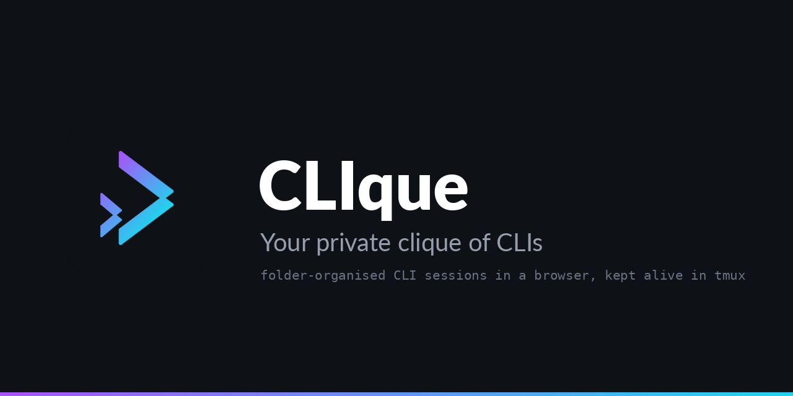

<p align="center">
  
</p>

<p align="center">
  <strong>A folder for every CLI on the box. Coding sessions in the browser, kept alive in tmux.</strong><br>
  Claude Code, Grok, Gemini, Codex, or anything you add in four lines of config.
</p>

<p align="center">
  <a href="#quick-start"></a>
  <a href="#why-it-is-stdlib-only"></a>
  <a href="LICENSE"></a>
  <a href="https://github.com/thejdubb02/clique/actions/workflows/tests.yml"></a>
  <a href="CHANGELOG.md"></a>
  <a href="https://github.com/thejdubb02/clique/stargazers"></a>
  <a href="https://buymeacoffee.com/jdubb"></a>
  <a href="#support-the-dev"></a>
</p>

---

CLIque is a **driver, not an IDE**. It does not parse a vendor's protocol, impersonate a model, or reimplement the tools you already have. It keeps a private tmux server, puts every CLI session in a folder you can actually find, and gives you a browser to jump between them.

If you run more than two coding agents at once, you already know the problem: terminals everywhere, no idea which one is waiting on you, a conversation you cannot get back to. CLIque is the panel for that.

**24 MB resident.** No framework, no `node_modules`, no build step. `tmux`, a PTY, and the Python standard library.

## Who it is for

You already run more than one coding agent. Claude Code, Grok, Gemini, Codex, or the next one, and you have lost track of which terminal is waiting on you. CLIque is the panel in front of them. It is not an IDE, not a chat client, and not a replacement for the CLIs themselves.

If you are happy with a tmux session per project, you do not need this. If you want the tool to *be* the agent, look elsewhere.

## What it does

| | |
|---|---|
| **Command palette** | `Ctrl`/`Cmd`+`K`: fuzzy jump between sessions, most-recently-used first. `>` commands, `@` sessions, `~` past conversations. |
| **History** | Every conversation your CLIs have kept, filed by directory, resumable in one click. Repeated runs of the same scheduled agent fold into one row. |
| **Folders** | A tree. Drag-drop, double-click rename, right-click, search, collapse to a rail (`Ctrl`/`Cmd`+`B`). |
| **Tabs** | Drag to reorder, `Alt`+`1`–`9` to jump. Closing a tab is not killing the session. tmux and the CLI keep running. |
| **Terminal** | Live output, full scrollback on reattach, resize, auto-reconnect, themed to the panel. |
| **Links** | URLs in the pane are clickable: a new tab, or a new window with `Ctrl`/`Cmd`. `http(s)` only. |
| **Scroll lock** | Scroll up and the view detaches from the stream. A badge says how far behind you are; the bottom, the lock, or `Ctrl`/`Cmd`+`Shift`+`L` catches you up. |
| **Paste a screenshot** | `Ctrl`/`Cmd`+`V` saves the image into the session's own directory and drops the path where you were typing. Nothing is sent until you press enter. |
| **See what it made** | An agent writes a screenshot into the session's directory and a count appears in the tab bar. Grid, full size, and the path back into your prompt in one click. |
| **Prompt drafts** | A half-typed instruction survives a tab switch, a reload, and a closed laptop. Per session, on the server, so it follows you to another device. |
| **Workspace** | Open tabs, their order, the one in front, and which groups are collapsed live on the server. Sign in somewhere else and the panes are where you left them. |
| **Status** | A ring around the CLI's own logo: an arc turning means working, a steady pulse means finished and waiting for you, idle draws nothing. The logo is never recoloured. |
| **Waiting on you** | Three tiers: tmux's clock, regexes you declare per CLI, and a `POST .../attention` a session fires from your own hook. Nothing here knows which vendor is talking. |
| **Unread** | A dot on anything that produced output while you were elsewhere, and a rule in the pane where you stopped reading. |
| **Which CLI** | The pane edge, the active tab and the prompt box carry the CLI's colour, so switching tabs tells you where you are typing. Colours editable per CLI. |
| **Themes** | Nine presets, light / dark / system, custom CSS in three slots, independent font sizes. |
| **API** | Every action in the panel is an HTTP call, with bearer tokens and read-only ones. Full reference in [API.md](API.md), kept honest by a drift check in the test suite. |
| **Changelog** | Settings → Changelog: every release with the time it shipped, read from this repo's `CHANGELOG.md` so the two cannot disagree. |
| **Told, not checked** | One webhook URL, POSTed when a session wants you, errors, finishes or dies. ntfy, Gotify, Discord, Mattermost and Uptime Kuma push all speak it. Real phone notifications, no app of ours. |
| **Monitoring** | `GET /healthz` answers without a login. Point Uptime Kuma, Gatus or Healthchecks at it. Anonymously it says `{"ok": true}` and nothing else. |
| **Security** | Password login (scrypt), API tokens, CSRF, `Origin` and `Host` checks, CSP with per-response nonces. See [SECURITY.md](SECURITY.md). |
| **Touch** | Long press a session for the menu right-click gives, with tap targets sized for a finger. |
| **Installable** | PWA with a full icon set. (The layout is not mobile-optimised yet.) |

Not built, on purpose: subagent visualisation, a respawn controller, multi-host, a Ralph loop. Those need to know which vendor is talking. This product does not.

What is next, and why that order: [ROADMAP.md](ROADMAP.md). What shipped: [CHANGELOG.md](CHANGELOG.md).

## Quick start

Needs **Python 3.11+** and **tmux**. Nothing else.

```bash
pip install clique-panel     # or: uvx --from clique-panel clique

clique password              # prompted; stored as an scrypt hash
clique                       # http://127.0.0.1:3200
```

The command is `clique`; the package is `clique-panel` because `clique` on PyPI
belongs to an unrelated library. State lives in `$CLIQUE_HOME`, default
`~/.clique`. To edit the CLI catalogue on an installed copy, `clique config`
puts one in there for you.

From a checkout instead:

```bash
git clone https://github.com/thejdubb02/clique.git
cd clique
python3 -m clique password
python3 -m clique
```

It binds to loopback on purpose. Put a tunnel in front of it (Tailscale Serve, Caddy, nginx) if you want it from another machine. Do not bind it to the public internet. Anyone who reaches the panel has a terminal as the user that started it.

```bash
# optional: behind Tailscale
tailscale serve --bg --set-path /clique http://127.0.0.1:3200
```

A systemd user unit is in [`deploy/`](deploy/README.md).

`GET /healthz` answers without a login (`{"ok":true}` and nothing else), so Uptime Kuma, Gatus or Healthchecks can watch it.

## Adding a CLI

A block in [`clique/config/clis.toml`](clique/config/clis.toml). Reload the page. No restart, no code:

```toml
[cli.grok]
label   = "Grok CLI"
command = "grok"
args    = []
color   = "#6f42c1"
```

There is no per-CLI branch in the codebase. If adding one ever needs a code change, the design has failed.

Claude Code and Gemini CLI can also declare an **autonomy pill** (the mode above the prompt). That is four keys in the same block (`modes`, `mode_key`, `mode_label`), documented in the comments of `clis.toml`. Omit them and the pill stays hidden, which is the right default for a CLI whose approval is a launch flag.

## Why it is stdlib-only

A coding-agent session already costs hundreds of megabytes. The manager's job is to disappear into that budget. Measured: **24 MB resident**.

That also means the real ceiling on concurrent sessions is the agents, not this. On a 16 GB box with ~9 GB free, roughly a dozen at once.

## Design notes that are easy to get wrong

- **Own tmux server** (`tmux -L clique`). Isolated from everything else on the box.
- **A PTY exists only while a browser is attached.** An idle session costs this process nothing; cost scales with open tabs, not with session count.
- **Each viewer gets its own grouped tmux session.** Plain `attach` makes every client share one size, so tmux shrinks the pane to the smallest watcher.
- **Closing a tab is not killing a session.** Detach sends SIGHUP; tmux and the CLI carry on.
- **`kill()` refuses sessions that are not ours** unless forced.

## Tests

Neither suite is mocked. The failure modes worth catching (tmux quoting, a PTY that never gets its first byte) only exist across a real socket. GitHub Actions runs all three on every push.

```bash
python3 tools/smoke.py                 # engine, against a real tmux server
python3 tools/smoke_http.py            # server, over real HTTP + WebSocket
python3 tools/api_drift.py             # API.md still covers every route and setting
ruff check .
```

They will not catch a UI that renders wrong. Open the page for that.

## Contributing

Patches welcome, with a short filter: [CONTRIBUTING.md](CONTRIBUTING.md). Feature ideas that need to know which vendor is talking get refused. That is the product, not a freeze.

## Support the dev

Free, and staying that way. If it saved you an afternoon, this is the tip jar.

**[Buy me a coffee](https://buymeacoffee.com/jdubb)**

| | Network | Address |
|---|---|---|
| **BTC** | Bitcoin | `3A3nA8BQFmXdvyUQokHhPd8HAd99wRDYFQ` |
| **SHIB** | Ethereum | `0x6b5DEd92946692D50642dC3af169727225E32D3b` |
| **DOGE** | Dogecoin | `DNiJeUJUVaVTDuteLXCtP7JVgvdL2NqoYp` |

## License

[MIT](LICENSE). Built by [Justin Willhite](https://github.com/thejdubb02).

A hole that reaches a terminal is a [private advisory](https://github.com/thejdubb02/clique/security/advisories/new), not a public issue. See [SECURITY.md](SECURITY.md).
