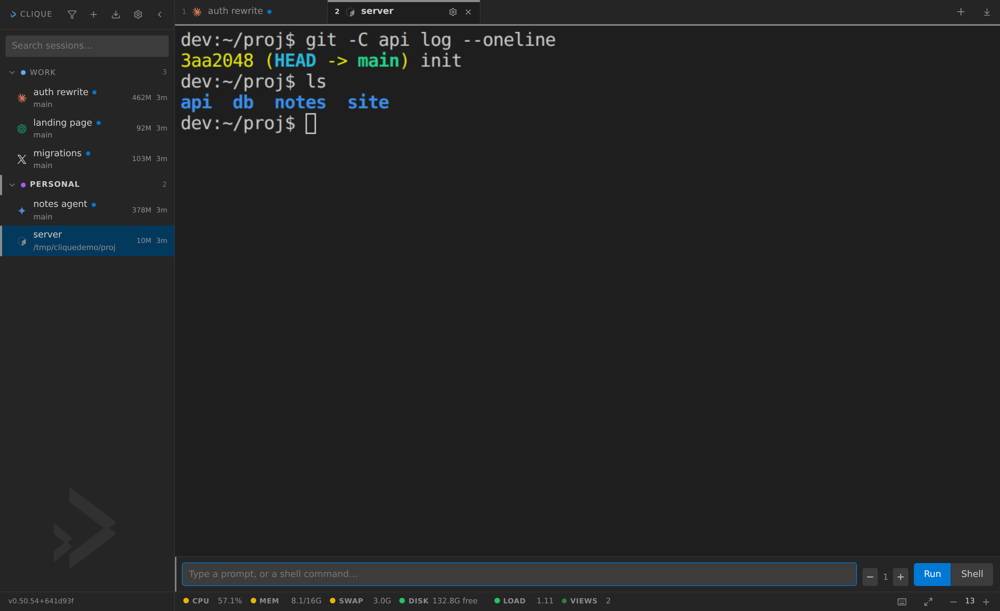
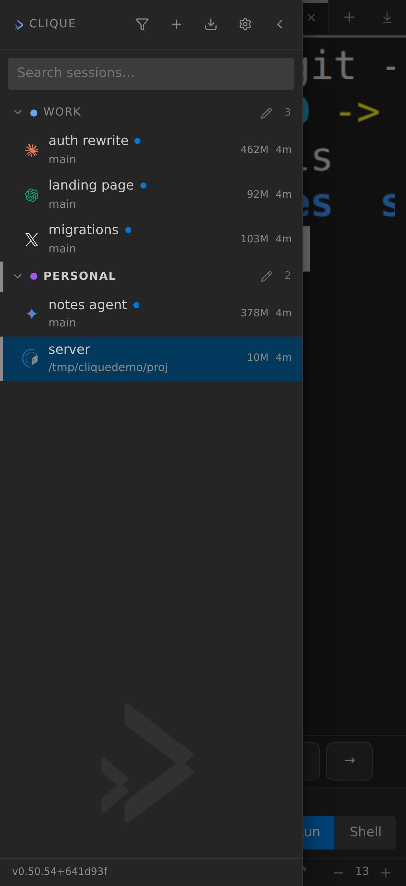

<p align="center">
  
</p>

<p align="center">
  <strong>A folder for every CLI on the box. Coding sessions in the browser, kept alive in tmux.</strong><br>
  Claude Code, Codex, Gemini, Grok, Antigravity, or anything you add in four lines of config.
</p>

<p align="center">
  <a href="#quick-start"></a>
  <a href="https://pypi.org/project/clique-panel/"></a>
  <a href="#why-it-is-stdlib-only"></a>
  <a href="LICENSE"></a>
  <a href="https://github.com/thejdubb02/clique/actions/workflows/tests.yml"></a>
  <a href="CHANGELOG.md"></a>
  <a href="https://github.com/thejdubb02/clique/stargazers"></a>
  <a href="https://buymeacoffee.com/jdubb"></a>
  <a href="#support-the-dev"></a>
</p>

---

CLIque is a **driver, not an IDE**. It does not parse a vendor's protocol, impersonate a model, or reimplement the tools you already have. It keeps a private tmux server, puts every CLI session in a folder you can actually find, and gives you a browser to jump between them.

If you run more than two coding agents at once, you already know the problem: terminals everywhere, no idea which one is waiting on you, a conversation you cannot get back to. CLIque is the panel for that.

**24 MB resident.** No framework, no `node_modules`, no build step. `tmux`, a PTY, and the Python standard library.

## Who it's for

**Using one AI coding agent?** Claude Code, Codex, Cursor's CLI, Gemini, Grok, Antigravity — CLIque puts it in your browser. Kick off a task, close the laptop, and check on it from your phone on the couch. Nothing to babysit, nothing to install but Python and tmux.

**Running several at once?** You already know the problem: terminals everywhere, no idea which one is waiting on you, a conversation you cannot get back to. CLIque is the one screen in front of all of them — folders, a status ring on each, one click to jump, and a real phone notification when one wants you.

**Driving a fleet?** Run ten agents across ten repos, each in its own git worktree so they do not step on each other, reap the idle ones to reclaim memory and resume them later exactly where they left off, and script the whole thing over an HTTP API.

It is **not** an IDE, not another AI, and not a replacement for your CLIs — it is the control panel in front of the tools you already use. If you want the tool to *be* the agent, look elsewhere.

## What it looks like

<p align="center">
  
</p>

Several agents in folders — Claude, Codex, Grok, Gemini, a shell — each with its
own icon, the git branch it is on, its memory, and a status dot. The same list
is a tap away on a phone:

<p align="center">
  
</p>

## What it does

New here? The [user guide](docs/guide.md) walks through everything below.

| | |
|---|---|
| **Command palette** | `Ctrl`/`Cmd`+`K`: fuzzy jump between sessions, most-recently-used first. `>` commands, `@` sessions, `~` past conversations. |
| **History** | Every conversation your CLIs have kept, filed by directory, resumable in one click. Repeated runs of the same scheduled agent fold into one row. |
| **Resume & reap** | An idle tab has its process stopped after a few hours — ~700 MB freed for an idle Claude — and its tab greys out. Click it and it resumes exactly where it was. Ten open tabs cost what two do. |
| **Worktrees** | Start a session in its own git worktree, so several agents work the same repo at once without touching each other's files. Delete the session and the worktree goes too — unless it has uncommitted work. |
| **Conversation view** | A CLI that draws full-screen keeps no scrollback; **View conversation** reads its transcript back — your turns and the assistant's prose, tools and thinking left out — in a clean sheet. |
| **Agent-drivable** | A one-word `state` per session, a `wait`-until-done call, and a skill, so an agent can drive CLIque itself: fan one task across many repos and collect the results. |
| **Filter** | One button in the sidebar hides every stopped session — and any folder left empty by it — so a list of two dozen collapses to what is actually running. |
| **Folders** | A tree. Drag to reorder folders and sessions, or drop a session on a folder to file it. Double-click rename, right-click, search, collapse to a rail (`Ctrl`/`Cmd`+`B`). Each row names the git branch it is on, and how many files have changed. |
| **Tabs** | Drag to reorder, `Alt`+`1`–`9` to jump. Names shrink first; what still will not fit lands in **N more**, wearing the same working / waiting ring. Closing a tab is not killing the session. |
| **Terminal** | Live output, full scrollback on reattach, resize, auto-reconnect, themed to the panel. Drag to copy, even when the CLI wants the mouse. `Ctrl`/`Cmd`+`C` copies a selection and interrupts when there isn't one; `Ctrl`/`Cmd`+`Shift`+`C` copies the screen. |
| **Links** | URLs in the pane are clickable: a new tab, or a new window with `Ctrl`/`Cmd`. `http(s)` only. A URL that wrapped onto the next line is still one link. A file path opens a read-only look — copy it, or drop it into the prompt. |
| **Scroll lock** | Scroll up and the view detaches from the stream. A badge says how far behind you are; the bottom, the lock, or `Ctrl`/`Cmd`+`Shift`+`L` catches you up. |
| **Paste a screenshot** | `Ctrl`/`Cmd`+`V` saves the image into the session's own directory and drops the path where you were typing. Nothing is sent until you press enter. |
| **See what it made** | An agent writes a screenshot into the session's directory and a count appears in the tab bar. Grid, full size, and the path back into your prompt in one click. |
| **Side panel** | A docked panel per session, from an icon rail on the right (`Ctrl`/`Cmd`+`J`). **Notes** are a nested checklist: checkboxes, Tab to nest, a one-click send into the terminal, and reminders that reach your phone. Plus **Git** (branch, diff, checkpoint), **Session info**, and **Export** the scrollback to a file. |
| **Prompt drafts** | A half-typed instruction survives a tab switch, a reload, and a closed laptop. Per session, on the server, so it follows you to another device. |
| **Workspace** | Open tabs, their order, the one in front, and which groups are collapsed live on the server. A reload attaches the tab you are looking at, then warms the rest in the background without resizing the pane. Sign in somewhere else and the strip is where you left it. |
| **Status** | A ring around the CLI's own logo: an arc turning means working, a steady pulse means finished and waiting for you, idle draws nothing. The logo is never recoloured. |
| **The box** | CPU, memory, disk and **VIEWS** in the bottom bar. Views is live connections on the box, not open tabs — hover if the number looks high; extras are another window or a phone. A reading the machine cannot report is not drawn at all, and readings drop out whole as the row narrows rather than being cut off mid-word. |
| **Plan left** | For the session in front, a meter each for whatever windows its CLI reports, green until three quarters and red past ninety, with the reset time on hover as a countdown. The panel does not know whose API that is: a CLI declares where its token is, which URL answers and which fields hold the numbers, so another vendor is a block of config. The token is read, spent on one request and dropped, and only percentages reach the browser. |
| **Waiting on you** | Three tiers: tmux's clock, regexes you declare per CLI, and a `POST .../attention` a session fires from your own hook. Nothing here knows which vendor is talking. |
| **Unread** | A dot on anything that produced output while you were elsewhere, and a rule in the pane where you stopped reading. |
| **Which CLI** | The pane edge, the active tab and the prompt box carry the CLI's colour, so switching tabs tells you where you are typing. Colours editable per CLI. |
| **Themes** | Sixteen presets, light / dark / system, custom CSS in three slots, independent font sizes, a monospace picker that falls back on every OS. The terminal wears the theme too, scrollbar and cursor and selection included. |
| **Characters** | Seven of the presets (Plumber, Triforce, Fellowship, Drizzt, Pacman, Tetris, Aincrad) carry a hand-drawn anime figure watermarked into the corner of the pane, laid in faintly enough to read straight through. They are original designs rather than the famous characters, which is a deliberate line: the archetype is fair to use and the likeness is not. It takes itself away on a narrow pane and on a phone, and one switch turns them all off. |
| **Make a theme** | Describe one ("a quiet winter morning, muted blues") and a model builds it, applies it, and keeps it on the server so it follows you to another device. It supplies the nine colours that need taste; the other eighteen, all sixteen ANSI colours with their brights, are derived and pushed until they can be read, so a generated theme cannot leave you somewhere you cannot see to change it back. Runs on your own key. |
| **Your own key** | Bring an OpenAI-compatible or Anthropic endpoint (OpenRouter, Groq, Together, a local Ollama) under Settings → Models. Keys are encrypted at rest and never returned by any endpoint. Each feature can point at a different provider. |
| **API** | Every action in the panel is an HTTP call, with bearer tokens and read-only ones. Full reference in [API.md](API.md), kept honest by a drift check in the test suite. |
| **Changelog** | Settings → Changelog: the last few releases, with a link to the rest on GitHub. After an upgrade, **What's new** sits on the bottom bar and goes straight there. |
| **Told, not checked** | One webhook URL, POSTed when a session wants you, errors, finishes or dies, or a note reminder comes due. ntfy, Gotify, Discord, Mattermost and Uptime Kuma push all speak it. Real phone notifications, no app of ours. |
| **Monitoring** | `GET /healthz` answers without a login. Point Uptime Kuma, Gatus or Healthchecks at it. Anonymously it says `{"ok": true}` and nothing else. |
| **Security** | Password login (scrypt), API tokens, CSRF, `Origin` and `Host` checks, CSP with per-response nonces. See [SECURITY.md](SECURITY.md). |
| **Touch** | Long press a session for the menu right-click gives, with tap targets sized for a finger. |
| **Phone & PWA** | Install it as its own app — no tabs, no URL bar, full screen from the bottom bar. Built for a phone browser too: a drawer sidebar, a full-width pane, an on-screen row for the keys a terminal needs (Esc, Tab, Ctrl+C, arrows), and a wheel that scrolls a full-screen CLI's own view. |

Not built, on purpose: subagent visualisation, a respawn controller, multi-host, a Ralph loop. Those need to know which vendor is talking. This product does not.

What is next, and why that order: [ROADMAP.md](ROADMAP.md). What shipped: [CHANGELOG.md](CHANGELOG.md).

## Quick start

Needs **Python 3.11+** and **tmux**. Nothing else.

```bash
pip install clique-panel     # or: uvx --from clique-panel clique

clique password              # prompted; stored as an scrypt hash
clique                       # http://127.0.0.1:3200
```

The command is `clique`; the package is `clique-panel` because `clique` on PyPI
belongs to an unrelated library. State lives in `$CLIQUE_HOME`, default
`~/.clique`. To edit the CLI catalogue on an installed copy, `clique config`
puts one in there for you.

From a checkout instead:

```bash
git clone https://github.com/thejdubb02/clique.git
cd clique
python3 -m clique password
python3 -m clique
```

It binds to loopback on purpose. Put a tunnel in front of it (Tailscale Serve, Caddy, nginx) if you want it from another machine. Do not bind it to the public internet. Anyone who reaches the panel has a terminal as the user that started it.

```bash
# optional: behind Tailscale
tailscale serve --bg --set-path /clique http://127.0.0.1:3200
```

A systemd user unit is in [`deploy/`](deploy/README.md).

`GET /healthz` answers without a login (`{"ok":true}` and nothing else), so Uptime Kuma, Gatus or Healthchecks can watch it.

## Adding a CLI

A block in [`clique/config/clis.toml`](clique/config/clis.toml). Reload the page. No restart, no code:

```toml
[cli.grok]
label   = "Grok CLI"
command = "grok"
args    = []
color   = "#6f42c1"
```

There is no per-CLI branch in the codebase. If adding one ever needs a code change, the design has failed.

Claude Code and Gemini CLI can also declare an **autonomy pill** (the mode above the prompt). That is four keys in the same block (`modes`, `mode_key`, `mode_label`), documented in the comments of `clis.toml`. Omit them and the pill stays hidden, which is the right default for a CLI whose approval is a launch flag.

## Why it is stdlib-only

A coding-agent session already costs hundreds of megabytes. The manager's job is to disappear into that budget. Measured: **24 MB resident**.

That also means the real ceiling on concurrent sessions is the agents, not this. On a 16 GB box with ~9 GB free, roughly a dozen at once.

## Design notes that are easy to get wrong

- **Own tmux server** (`tmux -L clique`). Isolated from everything else on the box.
- **A PTY exists only while a browser is attached.** An idle session costs this process nothing; cost scales with open tabs, not with session count.
- **Each viewer gets its own grouped tmux session.** Plain `attach` makes every client share one size, so tmux shrinks the pane to the smallest watcher.
- **Closing a tab is not killing a session.** Detach sends SIGHUP; tmux and the CLI carry on.
- **`kill()` refuses sessions that are not ours** unless forced.

## Tests

Neither suite is mocked. The failure modes worth catching (tmux quoting, a PTY that never gets its first byte) only exist across a real socket. GitHub Actions runs all three on every push. They start their own panel and tmux server, so they cannot touch the one you are using.

```bash
python3 tools/smoke.py                 # engine, against a real tmux server
python3 tools/smoke_http.py            # server, over real HTTP + WebSocket
python3 tools/api_drift.py             # API.md still covers every route and setting
ruff check .
```

They will not catch a UI that renders wrong. Open the page for that.

## Contributing

Patches welcome, with a short filter: [CONTRIBUTING.md](CONTRIBUTING.md). Feature ideas that need to know which vendor is talking get refused. That is the product, not a freeze.

## Support the dev

Free, and staying that way. If it saved you an afternoon, this is the tip jar.

**[Buy me a coffee](https://buymeacoffee.com/jdubb)**

| | Network | Address |
|---|---|---|
| **BTC** | Bitcoin | `3A3nA8BQFmXdvyUQokHhPd8HAd99wRDYFQ` |
| **SHIB** | Ethereum | `0x6b5DEd92946692D50642dC3af169727225E32D3b` |
| **DOGE** | Dogecoin | `DNiJeUJUVaVTDuteLXCtP7JVgvdL2NqoYp` |

## License

[MIT](LICENSE). Built by [Justin Willhite](https://github.com/thejdubb02).

A hole that reaches a terminal is a [private advisory](https://github.com/thejdubb02/clique/security/advisories/new), not a public issue. See [SECURITY.md](SECURITY.md).
